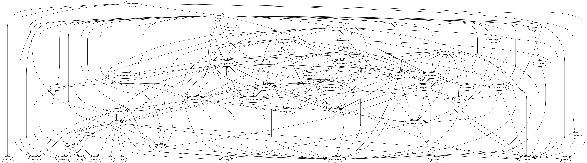

# lens-process

This package provides optics for the [process](https://hackage.haskell.org/package/process) package. These optics provide convenient lenses, traversals, and prisms, as well as classy variants for significant classifiable portions of the library. In addition, we provide some convenient combinators for working with `CreateProcess` types.

This package is intended to be on the lighter side, with few dependencies aside from `lens`. For full disclosure, this is the minimal dependency graph of `lens-process`:

